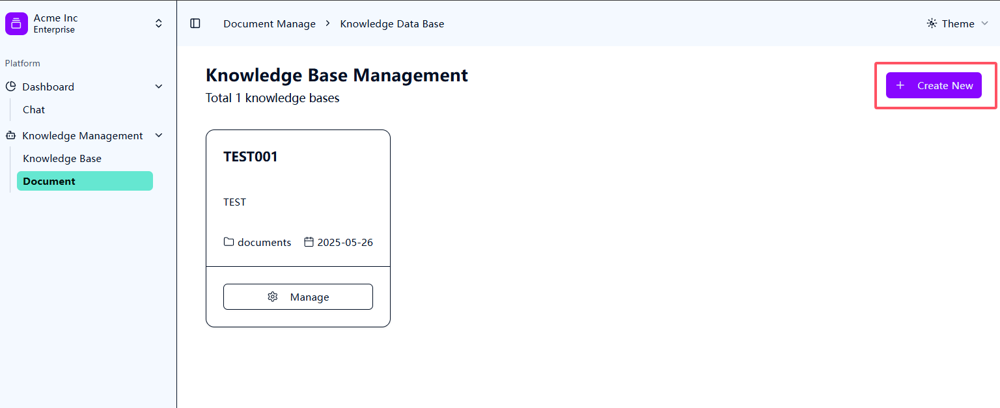
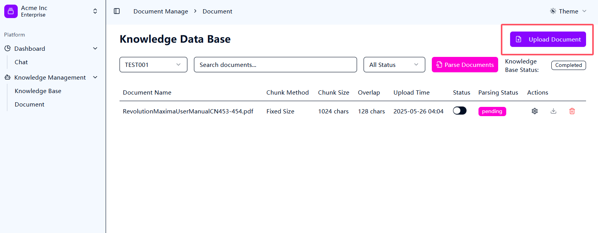
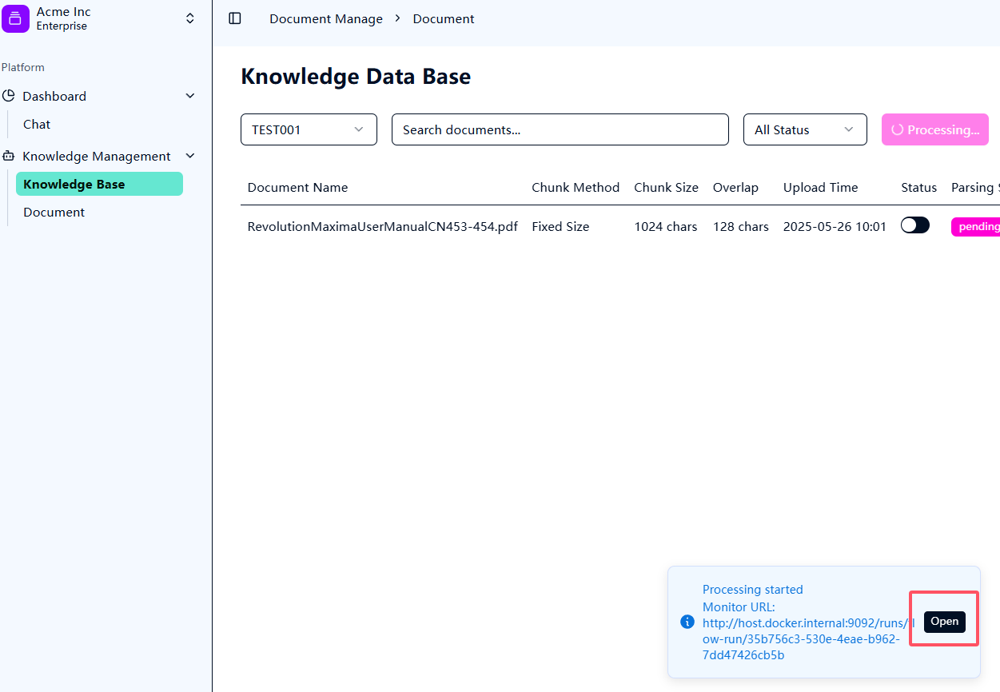

# 服务器部署文档

---

## **1. 安装 uv**

```bash
# windows
powershell -ExecutionPolicy ByPass -c "irm https://astral.sh/uv/install.ps1 | iex"

# linux
# 使用 curl 下载脚本并使用 sh 执行它：
curl -LsSf https://astral.sh/uv/install.sh | sh
# 如果您的系统没有 curl，则可以使用 wget：
wget -qO- https://astral.sh/uv/install.sh | sh

sh install.sh

# 使用 pip 安装
pip install uv

# Cargo 安装 (需要于 rust 环境)
cargo install --git https://github.com/astral-sh/uv uv
```

---

## **2. 导出 Poetry 依赖（可以跳过）**
生成生产依赖文件：
```bash
poetry export -f requirements.txt --output requirements.txt --without-hashes
```

生成开发依赖文件（可选）：
```bash
poetry export -f requirements.txt --output requirements-dev.txt --with dev --without-hashes
```

---

## **3. 创建虚拟环境**
使用 uv 创建虚拟环境（uv 兼容 `venv`）：
```bash
uv venv .venv
```

激活虚拟环境：
- **Linux/macOS**:
  ```bash
  source .venv/bin/activate
  ```
- **Windows**:
  ```cmd
  .\.venv\Scripts\activate
  ```

---

## **4. 安装依赖**
安装生产依赖：
```bash
uv pip install -r requirements.txt
```

安装开发依赖（可选）：
```bash
uv pip install -r requirements-dev.txt
```

---

## **4. 启动项目依赖**


### ** 后端服务 **
```bash
# 控制台直接启动
python -m med_rag_server

# 使用docker启动
docker-compose -f docker-compose.yml -f deploy/docker-compose.dev.yml --project-directory . up --build

```

### ** 前端服务 **

> 前端服务使用 pm2 管理

```bash
# 启动
pm2 start bun --name "med_rag_frontend" -- run dev
# 停止
pm2 stop med_rag_frontend
# 停止并删除进程​
pm2 delete med_rag_frontend
# 查看日志
pm2 logs med_rag_frontend
```

---

# RAG 系统使用文档

本系统支持新建不同的知识库，上传多个pdf文件并解析。

---

## 如何创建知识库



---

## 如何上传文档到知识库



---

## 如何解析文档和查看日志




---

## 提问和回答

