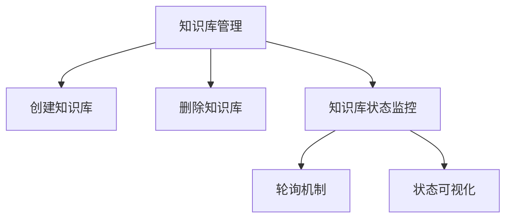
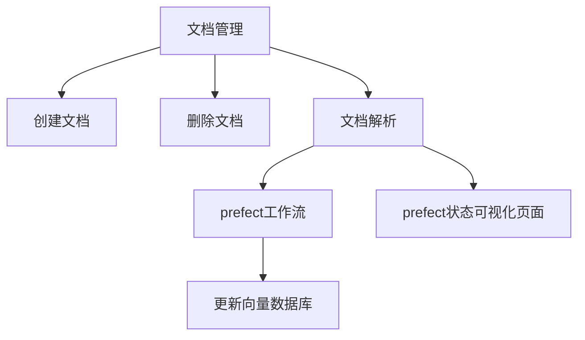
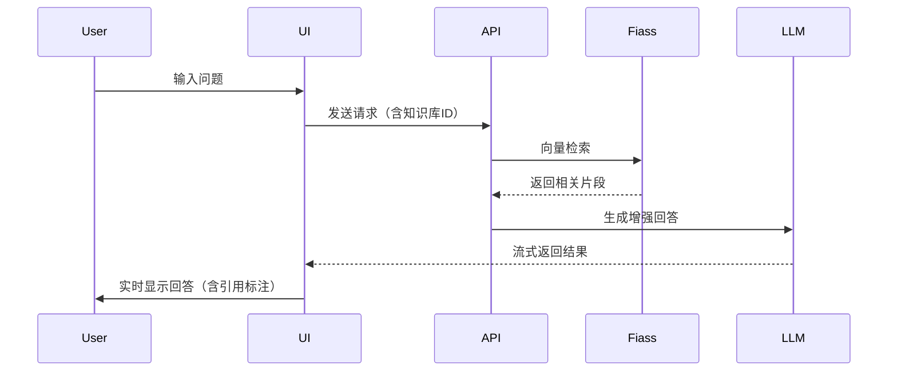
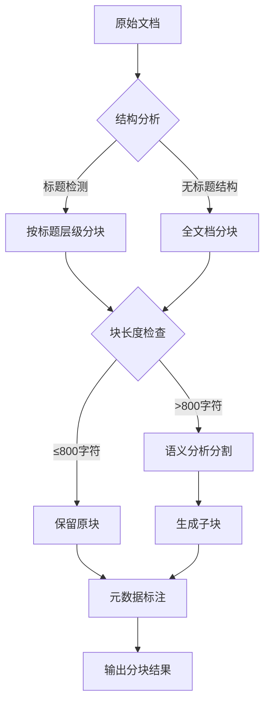
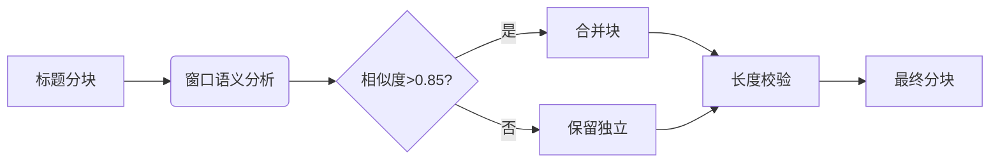
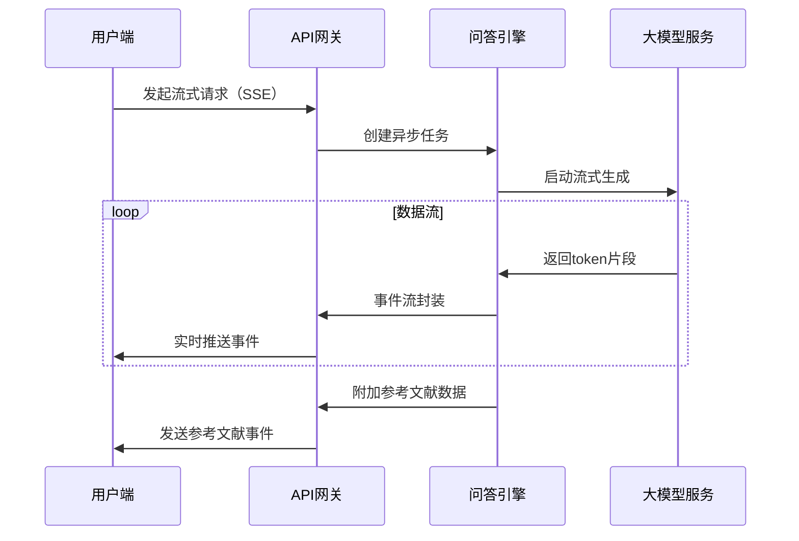

# 项目设计与部署文档

## 一、项目设计


### 1. 模块划分

#### (1) 知识库管理模块


#### (2) 文档处理模块




#### (3) 聊天交互模块


### 3. 核心功能实现

#### 文档分块处理


### 3. 核心功能实现补充说明

#### 文档分块处理

##### 混合分块策略 (Hybrid Chunking)
**设计思路**：
采用多层级分块策略，结合文档结构和内容语义，实现智能分块：
1. **结构感知分块**：优先识别Markdown标题层级（H1-H6），将文档划分为逻辑章节
2. **动态二次分割**：对超过阈值（默认800字符）的块进行智能细分，算法特点：
   - 代码块保护机制：完整保留```代码块```内容，不计入长度计算
   - 自然段落优先：优先在段落边界（`\n\n`）进行分割
   - 标点敏感分割：支持中英文句末标点（。！？.?）作为分割点
3. **元数据继承**：自动记录标题层级信息（如{"H2":"技术参数","H3":"电气特性"}）

**流程图**：


##### 命题生成引擎

**功能亮点**：
- **原子化命题生成**：将复杂段落拆分为独立事实陈述，例如：
  ```markdown
  1. CT-2000型扫描仪支持0.5mm层厚
  2. 设备配备双能量X射线管
  3. 扫描床承重可达200kg  
  ```
- **质量评估模型**：采用四维评估体系：
  | 指标        | 评估标准                          | 阈值  |
  |-------------|---------------------------------|-------|
  | 准确性      | 命题与原文事实一致性              | ≥7/10 |
  | 清晰度      | 无上下文独立理解程度              | ≥7/10 |
  | 完整性      | 关键参数（数值/单位）完整性        | ≥6/10 |
  | 简洁性      | 无冗余信息的单事实陈述            | ≥7/10 |

- **动态回退机制**：未达阈值的命题自动回退至原文分块

##### 语义分块优化
**技术实现**：
1. **多模型协同**：
   - 初级分块：`MarkdownHeaderTextSplitter` 进行标题分割
   - 语义分析：`OllamaEmbeddings` 计算文本向量相似度
   - 窗口滑动检测：3句窗口的语义连贯性分析

2. **自适应合并策略**：
   - 过短块合并（<150字符）
   - 语义相似块聚合
   - 元数据继承与增强

**性能优化**：


#### 流式响应处理

# RAG 智能问答系统设计与部署文档（补充流式响应部分）

## 三、核心功能模块（补充）
### 3. 智能问答系统（流式响应增强）

#### 流式响应处理机制


#### 关键技术实现
1. **事件流协议**
- 采用 Server-Sent Events (SSE) 协议
- 数据分片间隔：100-300ms/Token
- 事件类型划分：
  ```markdown
  | 事件类型     | 内容格式               | 触发时机              |
  |--------------|-----------------------|---------------------|
  | data         | {delta: "文本片段"}   | 每个Token生成时      |
  | references   | {sources: [...]}      | 回答生成完成时        |
  | error        | {error: "描述信息"}   | 发生可恢复错误时      |
  ```

2. **异步处理机制**
- 双通道并发控制（问答生成与事件推送）
- 异常熔断策略：3次连续错误触发服务降级

3. **参考文献处理**
- 来源标识：文档ID + 段落编号
- 置信度评分：0.8阈值过滤
- 动态排序：相关性 + 时效性加权


## 二、项目部署


---
### 1. 安装必要工具
```bash

# 安装 Node.js 和 npm (仅 PM2 依赖)
apt-get install -y nodejs npm

# 安装 Bun (必须)
curl -fsSL https://bun.sh/install | bash

# 安装 PM2 全局
npm install -g pm2
```

---

### 2. 直接通过命令行启动
```bash
pm2 start "bun run dev" \
  --name "my-bun-app" \    # 自定义应用名称
  --interpreter="bun" \   # 强制指定 Bun 解释器
  --watch \               # 可选：监听文件变化自动重启
  --no-autorestart        # 可选：禁用崩溃自动重启（开发环境建议关闭）
```

---

### 3. 管理应用
```bash
# 查看状态
pm2 list

# 查看日志
pm2 logs my-bun-app

# 停止应用
pm2 stop my-bun-app

# 重启应用
pm2 restart my-bun-app
```

---

### 4. 设置环境变量（可选）
直接在启动命令前添加：
```bash
PORT=3000 NODE_ENV=development pm2 start "bun run dev" --name my-bun-app --interpreter=bun
```

---

### 5. 持久化进程（服务器重启后自启）
```bash
pm2 save      # 保存当前进程列表
pm2 startup   # 生成开机启动脚本
```

---

### 注意事项：
1. **解释器路径验证**：
   ```bash
   which bun  # 查看 bun 的安装路径
   # 如果返回空，需重新安装 Bun 或添加环境变量
   ```

2. **参数传递限制**：
   - 如果 `bun run dev` 需要附加参数（例如 `--port 3000`），直接写在命令中：
     ```bash
     pm2 start "bun run dev --port 3000" --name my-bun-app --interpreter=bun
     ```

3. **生产环境警告**：
   - `dev` 模式不建议用于生产环境，应改用 `bun run build` + `bun run start`

4. **错误排查**：
   ```bash
   pm2 logs my-bun-app --lines 100  # 查看最后 100 行日志
   ```

---