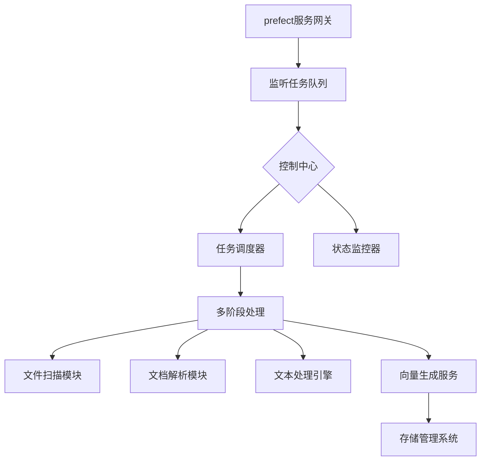
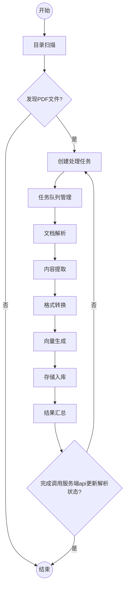
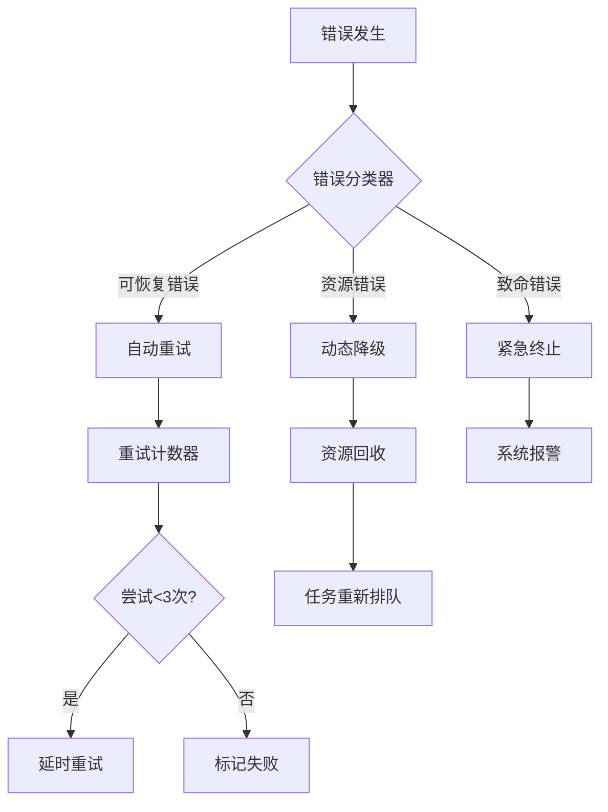
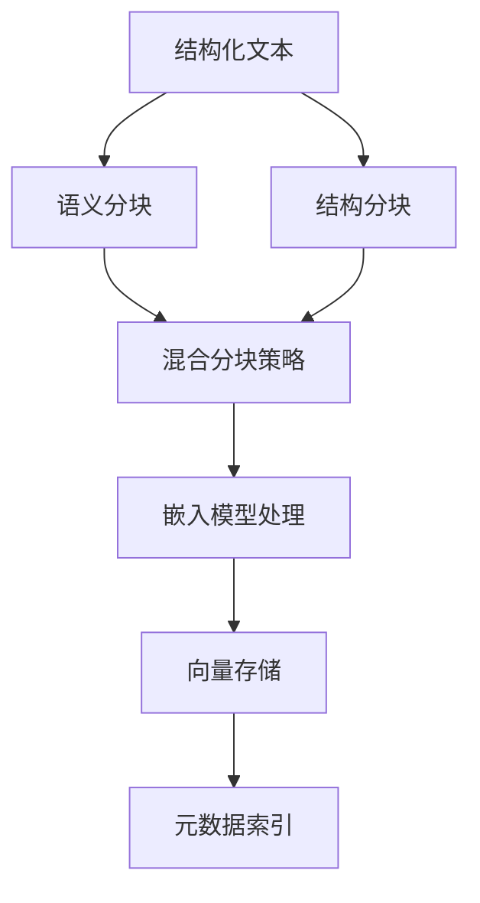

# PDF文档批量处理系统文档

## 一、系统介绍

### 1. 系统架构概览


### 2. 核心特性
- **多级目录处理**：自动识别10层嵌套结构
- **智能重试机制**：支持3级错误分类处理
- **全流程追溯**：文件级处理日志追踪


---

## 二、流程设计

### 1. 主处理流程图


#### 阶段说明：
1. **目录扫描**
   - 功能：递归遍历指定路径下的所有子目录
   - 参数：
     - `max_depth=10`：最大搜索深度
     - `ignore_pattern=temp*`：忽略目录模式
   - 输出：文件清单（JSON格式）

2. **任务分发**
   - 功能：动态分配任务到工作节点
   - 配置：
     - 优先级策略：先到先处理
     - 超时设置：300秒/任务
   - 异常处理：自动隔离失败任务

3. **文档解析**
   - 处理流程：
     ```mermaid
     graph LR
         A[PDF文件] --> B[元数据提取]
         B --> C[文本内容解析]
         C --> D[图像分离]
         D --> E[公式识别]
         E --> F[结构分析]
     ```
   - 关键参数：
     - 图像分辨率：300dpi
     - 公式识别模型：LaTeX-Match

4. **格式转换**
   - 功能模块：
     - 文本标准化（UTF-8编码）
     - 图像路径映射
     - Markdown模板渲染
   - 输出规范：
     - 层级标题：支持H1-H5
     - 交叉引用：自动生成文档链接

---

## 三、核心功能详解

### 1. 智能错误处理系统


#### 错误处理策略：
- **重试机制**：指数退避策略（2^n秒间隔）
- **降级方案**：
  - 关闭图像处理
  - 降低解析精度
  - 直接使用MinerU解析的数据


### 2. 向量存储生成
#### 处理流程：


#### 关键参数配置：
| 参数项          | 说明                     | 默认值      |
|----------------|--------------------------|------------|
| chunk_size     | 基础分块大小             | 1500字符    |
| overlap        | 块间重叠量               | 200字符     |
| model_name     | 嵌入模型名称             | bge-m3     |
| semantic_thold | 语义相似度阈值           | 0.85       |
| batch_size     | 批量处理量               | 32         |

---

## 四、部署prefect


> 必须要先启动server的docker,见README_SERVER.md

```
nohup python3 document_process_flow.py > output.log 2>&1 &
```