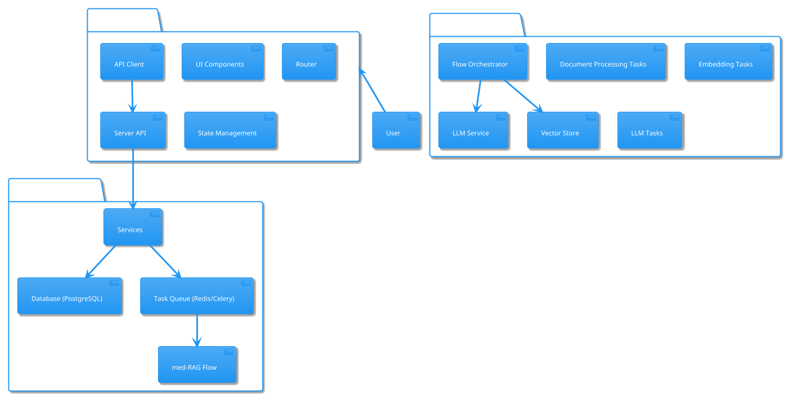
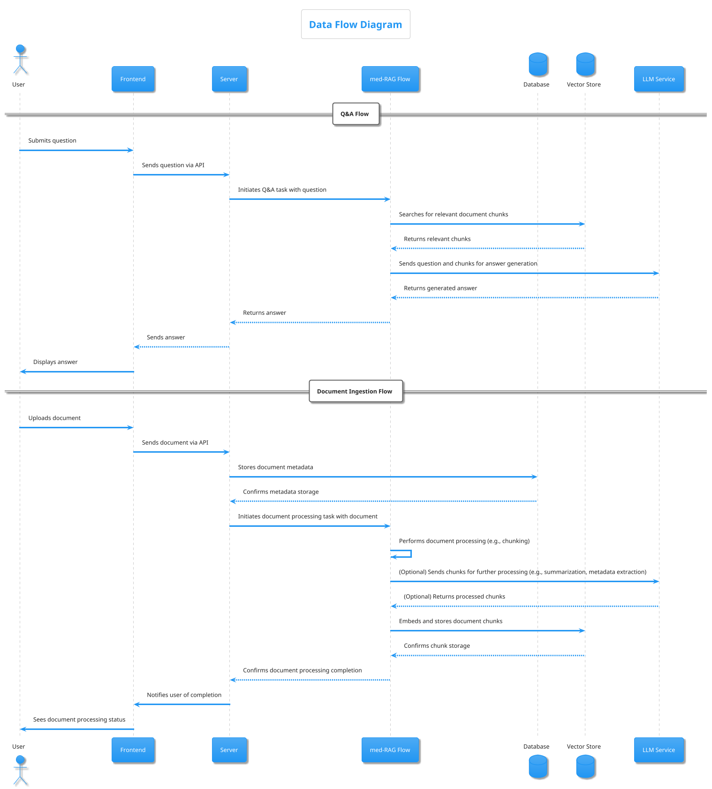
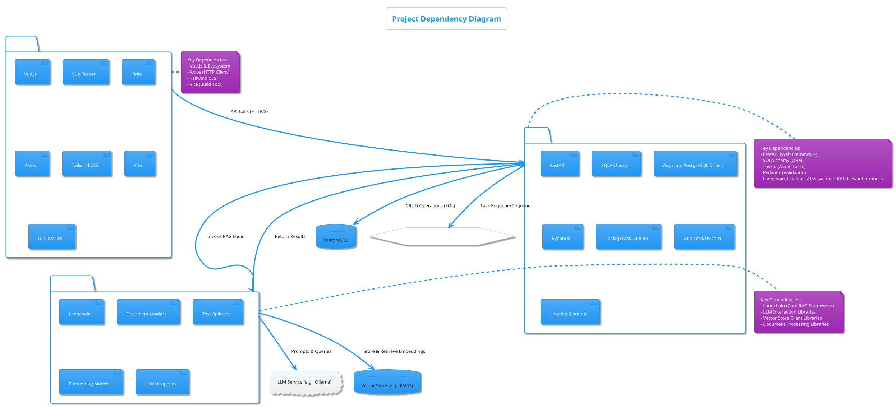

# Project Architecture Document

This document outlines the architecture of the project, including static structure, dynamic data flows, and key dependencies.

## 1. Static Architecture Diagram

This diagram provides a high-level overview of the main components of the system and their relationships.

## 2. Dynamic Data Flow Diagram

This diagram illustrates how data flows through the system during key operations, specifically for Q&A and Document Ingestion processes.

## 3. Overall Dependency Diagram

This diagram shows the key external libraries, frameworks, and services that each major component of the project depends on.

